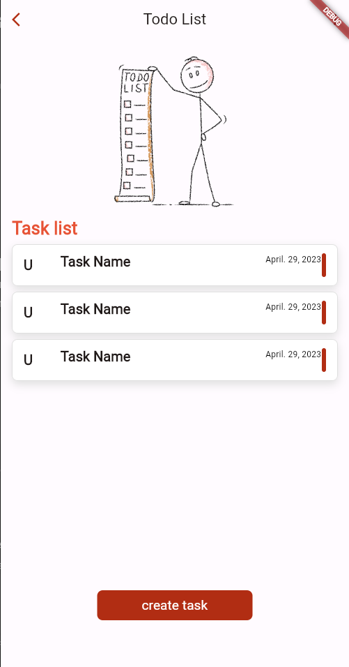
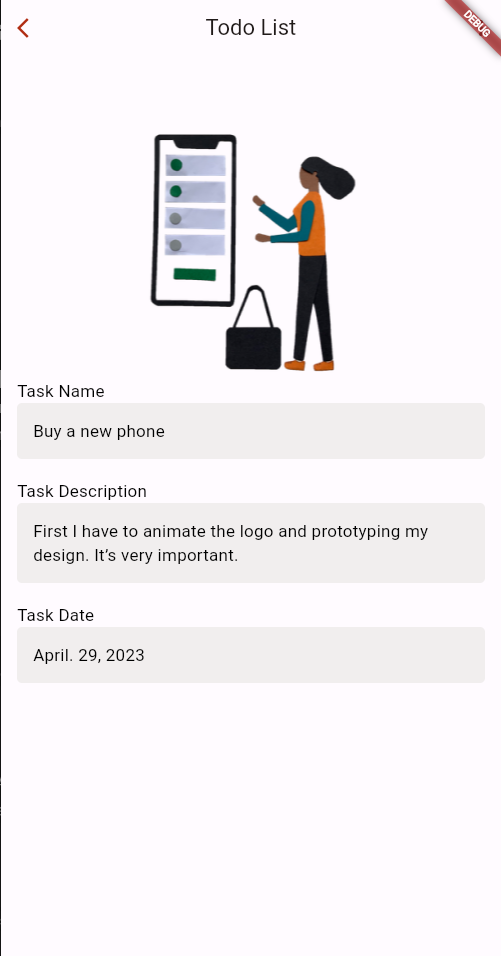
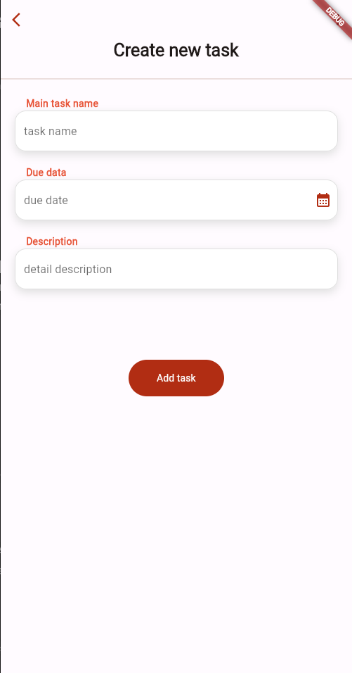

# Todo App with Clean Architecture

This is a simple todo app built using Flutter and the Clean Architecture pattern. The app allows users to create, view, update, and delete tasks and uses a local data source to store the tasks.

## Getting Started

To get started with the app, follow these steps:

1. Clone the repository:

   ````bash
   git clone https://github.com/your-username/todo-app-clean-architecture.git
   ```

   ````

1. Navigate to the project directory:

   ````bash
   cd todo-app-clean-architecture
   ```

   ````

1. Install the dependencies:

   ````bash
   flutter pub get
   ```

   ````

1. Run the app:

   ````bash
   flutter run
   ```

   ````

Make sure you have Flutter installed on your machine. If not, refer to the [Flutter documentation](https://flutter.dev/docs/get-started/install) for installation instructions.

## Architecture

The app follows the Clean Architecture pattern, which separates the app into three main layers:

1. **Presentation Layer**: This layer is responsible for displaying the UI and handling user input. It contains the app's screens, widgets, and the [BLoC](https://pub.dev/packages/flutter_bloc) for state management.

1. **Domain Layer**: This layer contains the business logic and use cases for the app. It defines the entities, repositories, and interactors that represent the core functionality of the app. The domain layer is independent of the presentation and data layers.

1. **Data Layer**: This layer is responsible for retrieving and storing data. It includes implementations of repositories and data sources. In this app, the [shared_preferences](https://pub.dev/packages/shared_preferences) package is used as the local data source.

## Packages Used

The app uses the following packages:

- [flutter_bloc](https://pub.dev/packages/flutter_bloc): State management library based on the BLoC (Business Logic Component) pattern.
- [shared_preferences](https://pub.dev/packages/shared_preferences): Provides a persistent key-value store for storing data locally.
- [uuid](https://pub.dev/packages/uuid): Generates unique IDs for tasks.
- [intl](https://pub.dev/packages/intl): Provides internationalization and localization utilities.
- [equatable](https://pub.dev/packages/equatable): Provides value equality for Dart classes.
- [mockito](https://pub.dev/packages/mockito): Provides a mockito-based mock package for testing.
- [dartz](https://pub.dev/packages/dartz): Provides functional programming features such as Option and Either.
- [rxDart](https://pub.dev/packages/rxdart): Provides reactive programming features for Dart.

## Features

The app includes the following features:

- Create a new task: Users can add new tasks by providing a title and due date.
- View all tasks: Users can see a list of all tasks with their titles, due dates, and completion status.
- View a single task: Users can view the details of a specific task, including the title, due date, and completion status.
- Update a task: Users can update the title, due date, and completion status of a task.
- Delete a task: Users can delete a task from the list.


Testing
Unit tests for core domain logic and repositories
Widget tests for UI and interactions
Run all tests:

   ````bash
   flutter test
   ````
## Screenshots

| Task List Screen | Task Detail Screen |OnBoarding Screen | Create Task Screen |
| ---------------- | ------------------ |------------------- |-------------------- |
|  |  |  |  |


